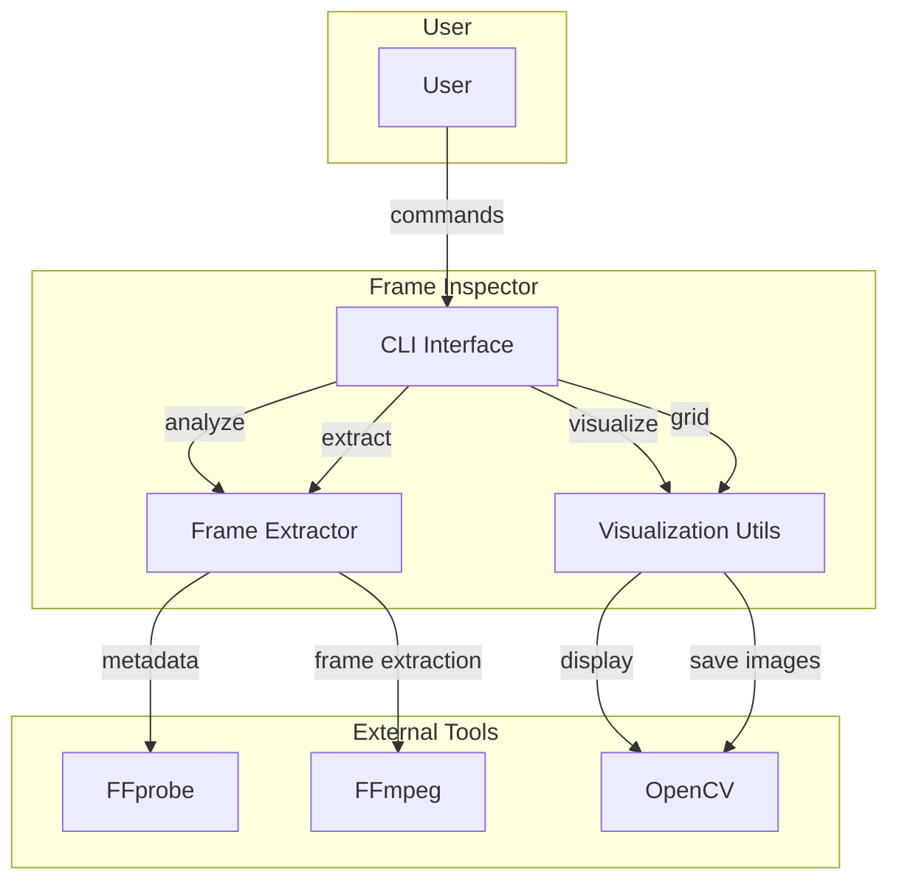
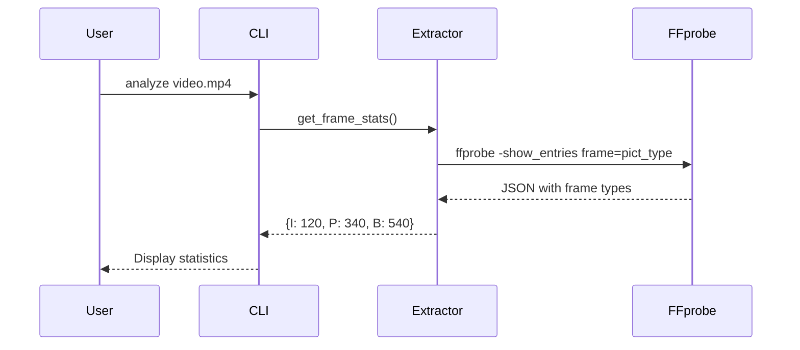
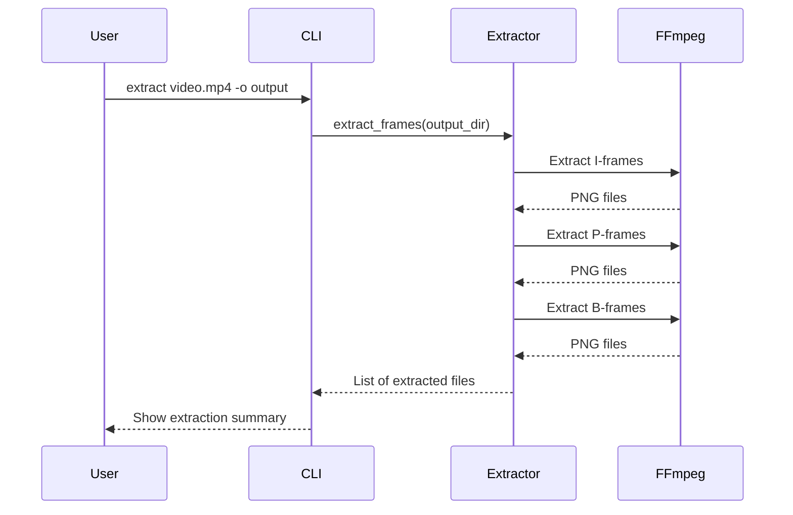
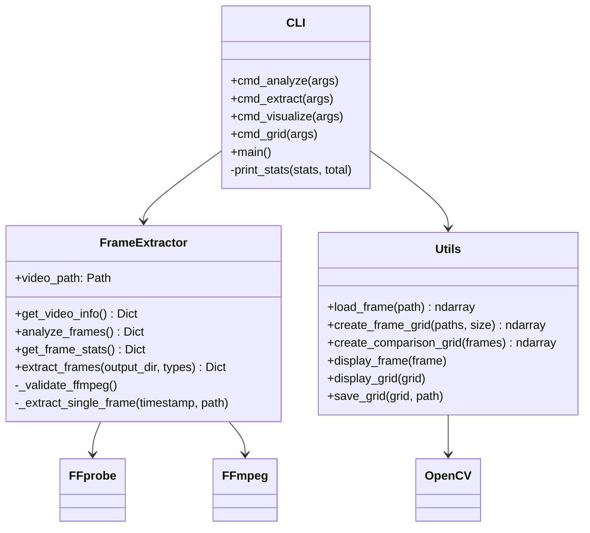

# Architecture Overview

## System Components



## Data Flow - Frame Analysis



## Data Flow - Frame Extraction



## Component Diagram



## Output Structure

```
output/
├── i_frames/
│   ├── frame_0000.png
│   ├── frame_0001.png
│   └── ...
├── p_frames/
│   ├── frame_0000.png
│   ├── frame_0001.png
│   └── ...
└── b_frames/
    ├── frame_0000.png
    ├── frame_0001.png
    └── ...
```

## Frame Type Characteristics

| Type | Description | Size | Dependencies |
|------|-------------|------|--------------|
| I-Frame | Complete image, keyframe | Largest | None |
| P-Frame | Predicted from past | Medium | Previous I/P |
| B-Frame | Bidirectional prediction | Smallest | Past and future |
